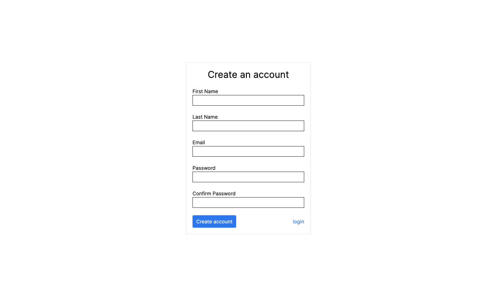
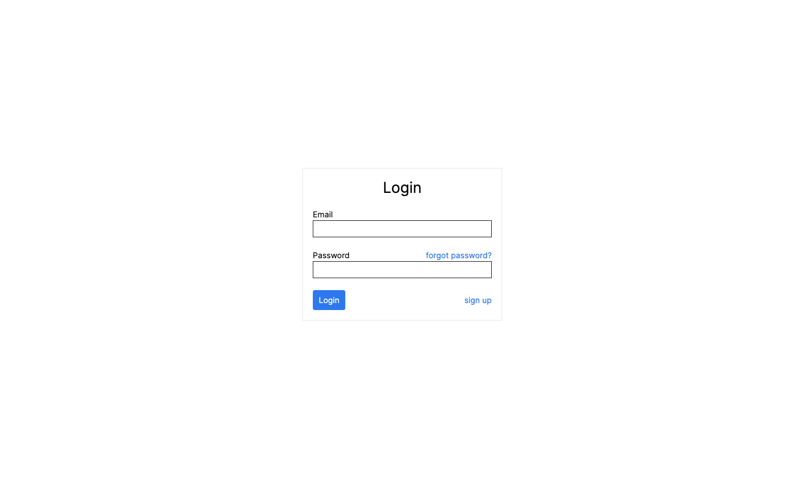
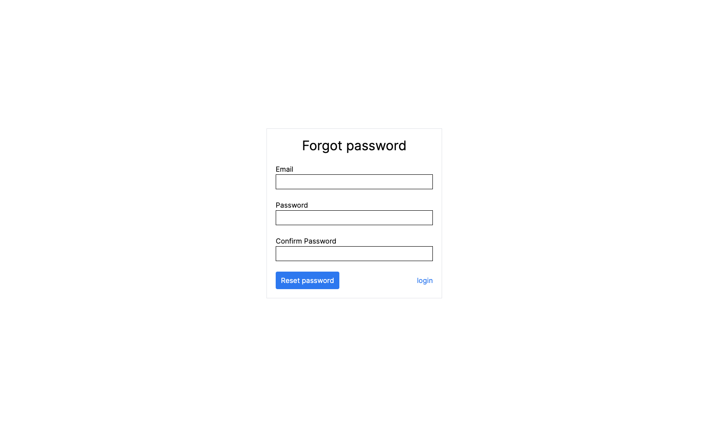
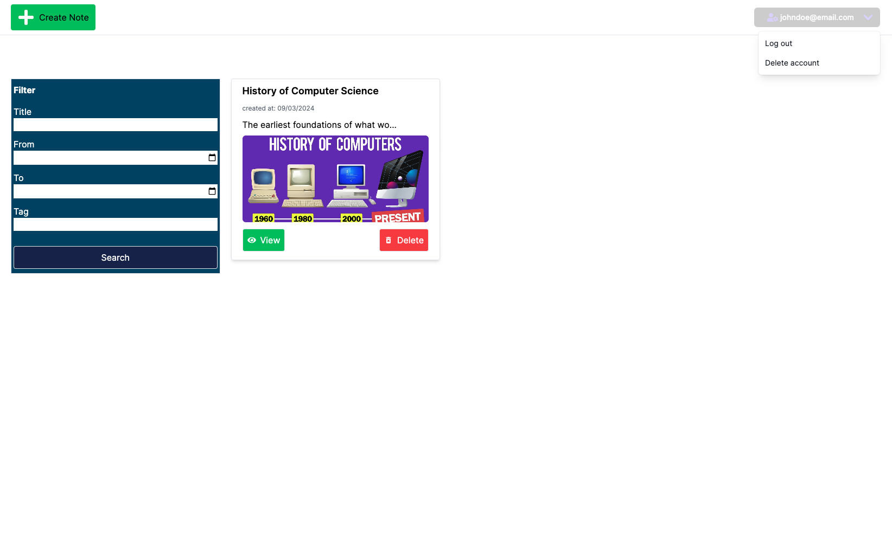
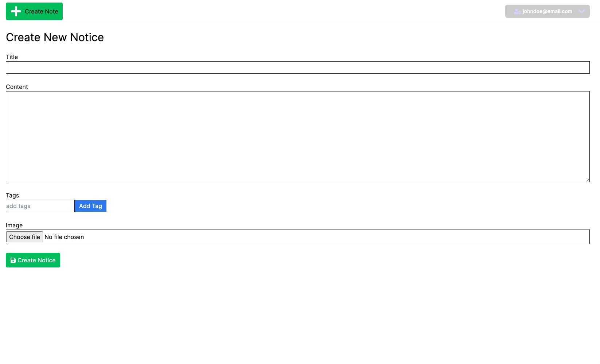
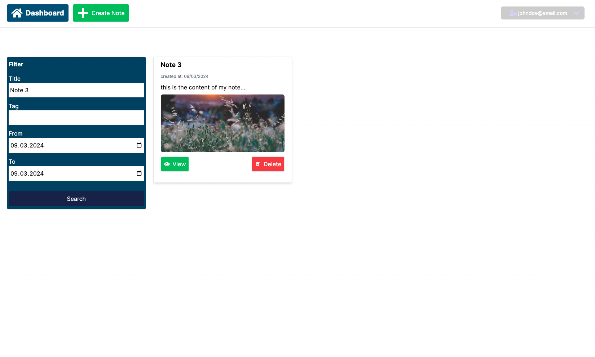
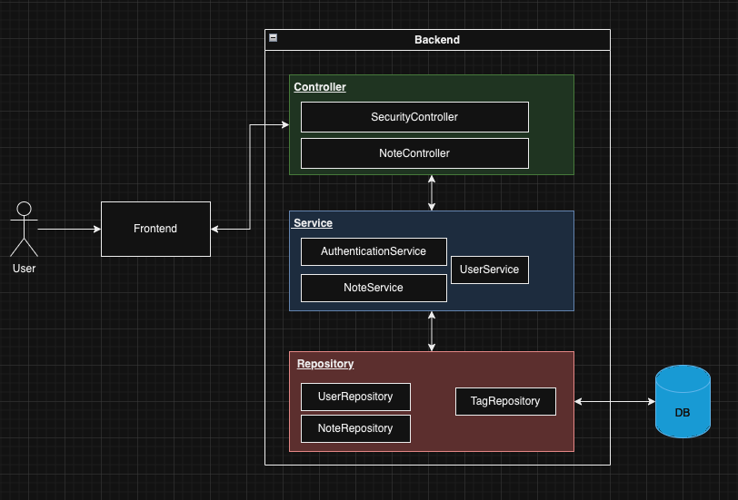

# Dokumentation

## Inhalt

- [Systemanforderungen](#systemanforderungen)
- [Projektstruktur](#project-structure)
- [Starten Die Anwendung](#starten-die-anwendung)
  - [Backend](#backend)
  - [Frontend](#frontend)
- [Installation](#installation)
  - [Backend](#backend)
  - [Frontend](#frontend)
- [Use Cases](#use-cases)

### Systemanforderungen

Dieses Projekt wird mit einem Java-Framework für das Backend und einem Javascript-Framework für das Frontend erstellt. 
Daher sind die folgenden Voraussetzungen erforderlich, um die Anwendung auszuführen:

- [Java 21](https://openjdk.org/projects/jdk/21/): Falls Sie Java 21 nicht installiert haben, können Sie es unter folgendem Link herunterladen
  [Java 21 Installation](https://www.oracle.com/fr/java/technologies/downloads/#jdk21-linux)

- [Node 20](https://nodejs.org/en): Falls Sie Node 20 nicht installiert haben, können Sie es über den folgenden Link herunterladen:
  - [windows](https://prototype-kit.service.gov.uk/docs/install/node-windows)
  - [linux](https://joshtronic.com/2023/04/23/how-to-install-nodejs-20-on-ubuntu-2004-lts/)

### Projektstruktur

Das Projekt gliedert sich in zwei Hauptteile: das Backend und das Frontend.

- Backend: Der Code des Backends befindet sich im Ordner `backend`.

- Frontend: Der Code des Frontends befindet sich im Ordner
  Ordner `frontend`.

### Starten Die Anwendung

Um die Anwendung zu starten, müssen Sie das Backend und das Frontend starten. Da das Frontend das Backend verwendet, müssen Sie zuerst das Backend starten, bevor Sie das Frontend starten.

#### Backend

```bash
# Navigieren Sie zum Backend-Ordner und führen Sie je nach Betriebssystem den folgenden Befehl aus
# Fenster
gradlew.bat bootRun
# Linux
./gradlew bootRun
```

#### Frontend

```bash
# Navigieren Sie zum Frontend-Ordner und führen Sie den folgenden Befehl aus
npm installieren
npm run dev
```


### Anforderungen

In diesem Abschnitt der Dokumentation werden die funktionalen Anforderungen der Anwendung beschrieben. Die Anwendung 
ist eine einfache Notizanwendung mit den folgenden funktionalen Anforderungen (zu jeder Anforderung haben wir ein Bild angefügt, das zeigt, wie es visuell aussieht, wenn die Anwendung ausgeführt wird):

### 1. Benutzerverwaltung
Jeder Benutzer kann sich registrieren und in die Anwendung einloggen. Darüber hinaus kann der Benutzer sich ausloggen 
oder sogar sein Konto löschen. 

- Konto anlegen
  

- Einloggen
   

- Passwort vergessen
  

### 2. Notizverwaltung

Jeder Benutzer kann seine Notizen erstellen, aktualisieren, löschen und anzeigen. Die Screenshots unten zeigen die 
Anwendungsfälle der Notizverwaltung.

- Alle Notizen anzeigen
  

- Einzige Notiz anzeigen
  

- Notiz anlegen
  

- Notiz filtern
  


### Implementierung

Dieser Teil der Dokumentation beschreibt ausführlich die Implementierungsdetails der Anwendung. Er ist in zwei Teile unterteilt: 
Zunächst werden wir die Hauptbausteine des Backends vorstellen. Anschließend werden wir die Struktur der Frontend-Anwendung sowie die Verbindung zum Backend erläutern.

#### Backend

Wie bereits erwähnt, ist das Backend der Anwendung in Java geschrieben. Um den Entwicklungsprozess zu erleichtern, haben 
wir das Spring Boot Framework und seine verschiedenen Module verwendet. Im Rest des Abschnitts werden wir zuerst die 
verschiedenen Spring Boot Module vorstellen, die wir verwendet haben, und wie wir sie verwendet haben. Anschließend 
werden wir die Architektur der Anwendung vorstellen. Schließlich werden wir die Kern Java Klassen des Backends präsentieren.

### 1. Spring Boot-Module verwendet.

Der Backend-Service ist ein RESTful-Dienst. Daher wird das **Spring Boot Web** modul verwendet. Dieses Modul bietet einen integrierten 
Server und Werkzeuge zur problemlosen Bereitstellung von Ressourcen über verschiedene REST-Endpunkte. Die verschiedenen Ressourcen, 
die vom Backend bereitgestellt werden, werden in einer Datenbank gespeichert. Das Backend verwendet **Spring Boot Data JPA**, 
um eine einfache Kommunikation mit der Datenbank zu ermöglichen. Wie der Name schon sagt, verwendet dieses Modul JPA (Java Persistence API), 
einen Java-Standard, der hauptsächlich die Kommunikation zwischen Java-Anwendungen und relationalen Datenbanken erleichtern soll. 
JPA ermöglicht hauptsächlich die Zuordnung von Java-Klassen zu Tabellen und die Definition von Beziehungen zwischen diesen verschiedenen Tabellen. 
Neben den standardmäßigen Funktionalitäten von JPA kommt Spring Data JPA auch mit mehreren Komponenten, die die Erstellung, 
Auswahl, Änderung und Löschung von Informationen in der Datenbank erleichtern. Schließlich verwendet das Backend **Spring Boot Security**, 
um die Anwendung abzusichern und vor allem die Anwendung mehrbenutzerfähig zu machen. Nur Benutzer mit einem gültigen Benutzerkonto und 
Zugangsdaten haben Zugriff auf die Informationen der Anwendung. Darüber hinaus kann jeder Benutzer nur auf die von ihm erstellten Daten zugreifen.

### 2. Architektur



Das obenstehende Bild zeigt die Architektur der Anwendung mit Schwerpunkt auf dem Backend. Das Backend besteht aus 3 Schichten: Controller, Service und Repository.

**Controller Layer**  
Diese Schicht enthält zwei Hauptklassen: SecurityController und NoteController. Diese Klassen sind hauptsächlich dafür verantwortlich, HTTP-Anfragen vom Frontend abzufangen.

Die Klasse **SecurityController** fängt alle Anfragen ab, die darauf abzielen, einen Benutzer anzulegen, sich anzumelden, abzumelden, Passwörter zu ändern und persönliche Informationen wie Namen und Nachnamen abzurufen. Diese Klasse ist von zwei Services abhängig: AuthenticationService und TokenService. Der SecurityController nutzt die Validierung von Spring Boot, um sicherzustellen, dass die vom Benutzer übermittelten Informationen korrekt sind, und delegiert dann die Anfragenverarbeitung an die AuthenticationService-Klasse, die später vorgestellt wird.

| Methode         | Parameter                                                                                                                                                                                     | Antwort                                                                                                                                                                                |
|----------------|-----------------------------------------------------------------------------------------------------------------------------------------------------------------------------------------------|------------------------------------------------------------------------------------------------------------------------------------------------------------------------------------------|
| register       | RegistrationRequest: <br/> Diese Klasse enthält Informationen über den zu erstellenden Benutzer. <br/> Diese Klasse enthält folgende Informationen: Name, Nachname, E-Mail und Passwort       | Wenn keine Fehler auftreten, gibt diese Methode dem Benutzer einen Zugriffs-Token zurück, den er für alle nachfolgenden Anfragen zur Authentifizierung verwenden muss.                                             |
| login          | LoginRequest: <br/> Diese Klasse enthält die erforderlichen Informationen für die Anmeldung. Diese Klasse enthält die E-Mail-Adresse und das Passwort des Benutzers, der sich anmelden möchte | Wenn keine Fehler auftreten, gibt diese Methode dem Benutzer einen Zugriffs-Token zurück, den er für nachfolgende Anfragen verwenden muss.                                                       |
| logout         | Nichts                                                                                                                                                                                        | Gibt dem Benutzer keine besonders wichtigen Informationen zurück                                                                                                                      |
| me             | Nichts                                                                                                                                                                                        | UserInfo: <br/> Diese Klasse enthält Informationen über den Benutzer (Name, Nachname, E-Mail, Passwort)                                                                                       |
| forgotPassword | ForgotPasswordRequest: <br/> Diese Klasse enthält die E-Mail-Adresse des Benutzers, der sein Passwort ändern möchte, sowie das neue Passwort                                                  | Wenn keine Fehler auftreten, gibt diese Methode dem Benutzer einen Zugriffs-Token zurück, den er für alle nachfolgenden Anfragen zur Authentifizierung verwenden muss.                                             |

```java
@RestController
@RequestMapping("/api/auth")
public class SecurityController {
    private final AuthenticationService authenticationService;
    private final TokenService tokenService;

    @PostMapping("/register")
    public ResponseEntity<ApiResponse> register(@RequestBody @Valid RegistrationRequest request) {
        // .... (not showed)
        return ResponseEntity.ok(registrationResponse);
    }

    @PostMapping("/login")
    public ResponseEntity<ApiResponse> login(@RequestBody @Valid LoginRequest request) {
      // .... (not showed)
        return ResponseEntity.ok(loginResponse);
    }

    @PostMapping("/logout")
    public ResponseEntity<ApiResponse> logout(final HttpServletRequest request) {
      // .... (not showed)
        return ResponseEntity.ok(logoutResponse);
    }

    @GetMapping("/me")
    public ResponseEntity<ApiResponse> me(@AuthenticationPrincipal  UserDetails userDetails) {
      // .... (not showed)
        return ResponseEntity
                .ok(this.authenticationService.me(userDetails));
    }

    @PutMapping("/forgot-password")
    public ResponseEntity<ApiResponse> resetPassword(@RequestBody @Valid ResetPasswordRequest request) {
      // .... (not showed)
        return ResponseEntity.ok(resetPasswordResponse);
    }
}
```


Die Klasse **NoteController** fängt alle Anfragen ab, die darauf abzielen, Notizen zu erstellen, zu lesen und zu löschen. 
Diese Klasse ist von NoteService abhängig. Der NoteController nutzt ebenfalls die Validierung von Spring Boot, 
um sicherzustellen, dass die vom Benutzer übermittelten Informationen korrekt sind, und delegiert dann die 
Anfragenverarbeitung an die NoteService-Klasse, deren Funktionalität später beschrieben wird.
